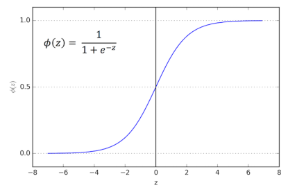

# Intro {.sidebar}
<b>Algoritimo: Regressão Logística</b>

A regressão logística é uma técnica estatística cujo objetivo é produzir, a partir de um conjunto de observações, um modelo que permita a predição de valores de uma variável categórica, frequentemente binária, a partir de uma série de variáveis explicativas contínuas e/ou binárias. É utilizada em áreas como:

<ul>
<li>Em medicina, permite determinar os fatores que caracterizam um grupo de indivíduos doentes em relação a indivíduos sãos.</li>
<li>No domínio dos seguros, permite encontrar frações da clientela que sejam sensíveis a determinada política securitária em relação a um dado risco particular.
<b><li>Em instituições financeiras, pode detectar os grupos de risco para a subscrição de um crédito.</li></b>
<li>Em econometria, permite explicar uma variável discreta, como por exemplo as intenções de voto em eleições.</li>
</ul>

```{r getAlpha, echo=FALSE}

# selectInput("valpha", "Alpha:", c(0.25,0.5,0.75), selected = 0.5)

```

```{r loadPacks, include=FALSE}

# install.packages('shiny')
library(shiny)
# install.packages('caTools')
library(caTools)
# install.packages('ROCR')
library(ROCR)
# install.packages('gplots')
library(gplots)
# install.packages('knitr')
library(knitr)
# install.packages("kableExtra")
library(kableExtra)
# install.packages("ElemStatLearn")
library(ElemStatLearn)

```


```{r Load, include=FALSE}

knitr::opts_chunk$set(echo = TRUE)

# Logistic Regression

# Importing the dataset
dataset = read.csv('churn.csv')
dataset = dataset[2:6]

# Positioning features in logical order
dataset <- dataset[c(2,3,4,5,1)]

```

```{r Split, include=FALSE}

# Splitting the dataset into the Training set and Test set

set.seed(123)
split        <- sample.split(dataset$Churned, SplitRatio = 0.9875)
training_set <- subset(dataset, split == TRUE)
test_set     <- subset(dataset, split == FALSE)

```

# Área de Dados

## Column 1

### Dados Utilizados:
```{r showDataset, echo=FALSE}
head(dataset)
```
A coluna <b>Churned</b> indica se o cliente abandonou (1) ou permaneceu com o serviço (0).

### Quantidade de Registros no Dataset:

```{r showSize, echo=FALSE}
noquote(paste("Registros: ", registros <- dim(dataset)[1]))
noquote(paste("Percentual de abandono: ", sum(dataset$Churned/registros)))
```

### Conjuntos de Treinamento e Teste
```{r printSetSizes, echo=FALSE}
noquote(paste("Registros do Training Set: ", registros <- dim(training_set)[1]))
noquote(paste("Registros do Test Set: ", registros <- dim(test_set)[1]))

```

## Column 2

### Gráfico de Correlação de Variáveis

```{r scatterplot, echo=FALSE}
# define the colors
colors <- c("green", "red")

# draw the plot matrix
a<-pairs(dataset[1:4], main = "Churn Dataset", pch = 21, bg = colors[unclass(dataset$Churned)+1] )

# set graphical parameter to clip plotting to the figure region
par(xpd = TRUE)

# add legend
legend(0.2, 0.02, horiz = TRUE, as.vector(unique(dataset$Churned)), fill = colors, bty = "n")
```

### Histogramas de Frequências

```{r Histograms, echo=FALSE}
par(mfrow=c(2,2))
hist(dataset$Age, col='blue', ylim = c(0,1000), xlim = c(10,70), xlab = 'Idade', main = 'Idade')
hist(dataset$Married, col='blue',  xlab = 'Estado Civil', xlim = c(0,1), main = 'Estado Civil')
hist(dataset$Cust_years, col='blue', breaks = 10, xlab = 'Tempo de Assinatura', ylim = c(0,3500), xlim = c(0,10), main = 'Tempo de Assinatura')
hist(dataset$Churned_contacts, col='blue', breaks = 6, xlab = 'Contatos que Saíram', ylim = c(0,4000), xlim = c(0,6), main = 'Contatos que Saíram')

```


```{r Scaling, include=FALSE}

# Feature Scaling
for (i in 1:4){
 training_set[,i] <- scale(training_set[,i], center = TRUE, scale = TRUE)
 test_set[,i]  <- scale(test_set[,i], center = TRUE, scale = TRUE)
}
```

# Modelagem

## Column 1

### Modelagem e Análises:

<b>Modelagem 1:</b>

Explicando a <b>Saída</b> em função da <b>Idade</b>, <b>Estado Civil</b>, <b>Tempo de Assinatura</b>, <b>Número de contatos que saíram do serviço</b>.
```{r LR-Train-1, echo=FALSE}

# Running Logistic Regression
Churn_logistic1 <- glm (Churned ~ Age + Married + Cust_years + Churned_contacts, data=training_set,
                        family=binomial(link="logit"))
summary(Churn_logistic1)
```
Vemos que a variável <b>Tempo de Assinatura</b> é pouco significativa, então vamos removê-la do modelo. Também suspeitamos que a variável <b>Estado Civil</b> não seja significativa. 


<b>Modelagem 2:</b>

Explicando a <b>Saída</b> em função da <b>Idade</b>, <b>Estado Civil</b>, <b>Número de Contatos que saíram do serviço</b>
```{r LR-Train-2, echo=FALSE}
# Removing non significant parameters e running again
Churn_logistic2 <- glm (Churned ~ Age + Married + Churned_contacts, data=training_set, 
                        family=binomial(link="logit"))
summary(Churn_logistic2)
```
Como suspeitávamosa a variável <b>Estado Civil</b> também não é significativa para a previsão, portando vamos removê-la do modelo. 


<b>Modelagem 3:</b>

Explicando a <b>Saída</b> em função da <b>Idade</b> e do <b>Número de Contatos que saíram do serviço</b>
```{r LR-Train-3, echo=FALSE}

# Removing non significant parameters e runnnig again
Churn_logistic3 <- glm (Churned ~ Age + Churned_contacts, data=training_set, 
                        family=binomial(link="logit"))
summary(Churn_logistic3)
```
Modelo final:  <b>Churned ~ Age + Churned_contacts</b>


```{r Prediction, include=FALSE}

# Final Model selected: Churned ~ Age + Churned_contacts

pred    <- predict(Churn_logistic3, type="response")
predObj <- prediction(pred, training_set$Churned )

rocObj <- performance(predObj, measure="tpr", x.measure="fpr")
aucObj <- performance(predObj, measure="auc")

```

# Análise

## Column 1

### ROC Curve

Esse indicador representa a performance de um modelo de classificação binário. Quanto mais próxima de 1 for a Área, melhor a performance da previsão.

```{r plotROC, echo=FALSE}

plot(rocObj, main = paste("Área Sob a Curva:", round(aucObj@y.values[[1]], 4)))

```

``` {r extractFPRetpr, include=FALSE}
# Extract the alpha(threshold), FPR, and TPR values from rocObj
alpha <- round(as.numeric(unlist(rocObj@alpha.values)),4)
fpr   <- round(as.numeric(unlist(rocObj@x.values)),4)
tpr   <- round(as.numeric(unlist(rocObj@y.values)),4)
```

## Column 2

### Gráfico FPR x TPR e Linha de Diferença

```{r plotFPRxTPR, echo=FALSE}
# adjust margins and plot TPR and FPR and difference
par(mar = c(5,5,2,5))
plot(alpha,tpr, xlab="Threshold", xlim=c(0,1), ylab="True positive rate", type="l")

par(new="True")
plot(alpha,fpr, xlab="", ylab="", axes=F, xlim=c(0,1), type="l" )
axis(side=4)
mtext(side=4, line=3, "False positive rate")
text(0.18,0.18,"FPR")
text(0.58,0.58,"TPR")

par(new="True")
plot(alpha,tpr-fpr, xlab="", ylab="", axes=F, xlim=c(0,1), type="l", col="red" )

```

```{r calcAlpha, include=FALSE}
# Best Alpha calculation
i <- which(round(alpha,2) < 1)
 paste("Threshold=", (alpha[i]) , " TPR=", tpr[i] , " FPR=", fpr[i], " DIFF=", tpr[i]-fpr[i])
valpha    <- cbind(alpha,tpr-fpr)
bestalpha <- valpha[which.max(valpha[,2]),1]  # Youden Index
```

### Calibragem do Parâmetro Alpha (threshold)

Melhor alpha: (Youden Index: Max(TPR-FPR))
```{r showAlpha, echo=FALSE}
# Melhor alpha calculado:
paste(bestalpha)
```

```{r DefineAlpha, echo=FALSE}
noquote(paste("Alpha utilizado na análise:", bestalpha <- 0.5))
```

### Função Logísitica




# Métricas de avaliação

## Column 1

```{r calcResults, include=FALSE}
# Removing non used features
training_set <- training_set[c(1,4,5)]
test_set <- test_set[c(1,4,5)]

# Fitting Logistic Regression to Training set of the final model 
classifier <- Churn_logistic3

# Predicting the Test Set results
prob_pred = predict(classifier, type = 'response', newdata = test_set[-3])
y_pred <- ifelse(prob_pred > bestalpha, 1, 0)

# y_pred <- ifelse(prob_pred > input$valpha, 1, 0)


# Making the confusion matrix
cm <- table(test_set[,3], y_pred)

Test_TP <- cm[1,1]
Test_TN <- cm[2,2]
Test_FP <- cm[1,2]
Test_FN <- cm[2,1]

TestPrecision <- Test_TP/(Test_TP+Test_FP)
TestRecall    <- Test_TP/(Test_TP+Test_FN)
TestAccuracy  <- (Test_TP+Test_TN)/(Test_TP+Test_TN+Test_FP+Test_FN)
```

<b>Confusion Matrix</b>
```{r printCM, echo=FALSE, result='asis'}

# Print Confusion Matrix

kable(cm, "html") %>%
  kable_styling(bootstrap_options = "striped", full_width = F, position = "center")

```

###<b>Classificações</b>
```{r printResult, echo=FALSE}
noquote(paste("True Positives  = ", Test_TP))
noquote(paste("True Negatives  = ", Test_TN))
noquote(paste("False Positives = ", Test_FP))
noquote(paste("False Negatives = ", Test_FN))
```

<b>Precision</b>
```{r printPrecision, echo=FALSE}
TestPrecision 
```

<b>Recall</b>
```{r printRecall, echo=FALSE}
TestRecall    
```

<b>Accuracy</b>
```{r printAccuracy, echo=FALSE}
TestAccuracy  
```

## Column 2

```{r Visualization, echo=FALSE}
#
# Visualization (for 2 features only)
#

# Visualising the Training set results

# set = training_set
# X1 = seq(min(set[, 1]) - 1, max(set[, 1]) + 1, by = 0.01)
# X2 = seq(min(set[, 2]) - 1, max(set[, 2]) + 1, by = 0.01)

# grid_set = expand.grid(X1, X2)
# colnames(grid_set) = c('Age', 'Churned_contacts')

# grid_set$Age <- as.matrix(grid_set$Age)
# grid_set$Churned_contacts <- as.matrix(grid_set$Churned_contacts)

# prob_set = predict(classifier, type = 'response', newdata = grid_set)
# y_grid = ifelse(prob_set > bestalpha, 1, 0)

# plot(set[, -3],
#     main = 'Classifier (Training set)',
#     xlab = 'Age', ylab = 'Churned Contacts',
#     xlim = range(X1), ylim = range(X2))
# contour(X1, X2, matrix(as.numeric(y_grid), length(X1), length(X2)), add = TRUE)
# points(grid_set, pch = '.', col = ifelse(y_grid == 1, 'tomato', 'springgreen3'))
# points(set, pch = 21, bg = ifelse(set[,3] == 1, 'red3', 'green4'))

# Visualising the Test set results 
library(ElemStatLearn)

set = test_set
X1 = seq(min(set[, 1]) - 1, max(set[, 1]) + 1, by = 0.01) # Age
X2 = seq(min(set[, 2]) - 1, max(set[, 2]) + 1, by = 0.01) # Churned Contacts

grid_set = expand.grid(X1, X2)
colnames(grid_set) = c('Age', 'Churned_contacts')

grid_set$Age <- as.matrix(grid_set$Age)
grid_set$Churned_contacts <- as.matrix(grid_set$Churned_contacts)

prob_set = predict(classifier, type = 'response', newdata = grid_set)
y_grid = ifelse(prob_set > bestalpha, 1, 0)

plot(set[, -3],
     main = 'Classificação por Regressão Logística (Test set)',
     xlab = 'Age', ylab = 'Churned Contacts',
     xlim = range(X1), ylim = range(X2))
contour(X1, X2, matrix(as.numeric(y_grid), length(X1), length(X2)), add = TRUE)
points(grid_set, pch = '.', col = ifelse(y_grid == 1, 'tomato', 'springgreen3'))
points(set, pch = 21, bg = ifelse(set[,3] == 1, 'red3', 'green4'))

```

# Previsão

```{r NewCustomer, include=FALSE}

# Predicting the New Customer Result

Age <- AgeOri <- c(30)
Churned_contacts <-Churned_contactsOri <- c(3)

# Appliyng Scale
Age <- (Age - attr(test_set$Age,'scaled:center'))/attr(test_set$Age,'scaled:scale')
Churned_contacts <- (Churned_contacts - attr(test_set$Churned_contacts,'scaled:center'))/attr(test_set$Churned_contacts,'scaled:scale')

prev_set <- data.frame(Age,Churned_contacts)

prev_set$Age <- as.matrix(prev_set$Age)
prev_set$Churned_contacts <- as.matrix(prev_set$Churned_contacts)

prob_prev = predict(classifier, type = 'response', newdata = prev_set)
y_prev <- ifelse(prob_prev > bestalpha, 1, 0)
y_prev <- unname(y_prev)

```

### Previsão de saída para indivíduo

```{r printPrevisao, echo=FALSE}

noquote(paste("Idade:",AgeOri))

noquote(paste("Churned Contacts:",Churned_contactsOri))

noquote(paste("Previsão:", ifelse(y_prev==0,"Não Sairá ( Probabilidade de saída:","Sairá ( Probabilidade de saída:"), format(prob_prev,digits=2), ")"))


```

# Outros Algoritmos de Classificação
<br></br>
<ul>
<li>Decision Tree</li>
<li>Kernel SVM</li>
<li>KNN</li>
<li>Naive Bayes</li>
<li>Randon Forest</li>
<li>SVM</li>
<li>Artificial Neural Networks</li>
</ul>

